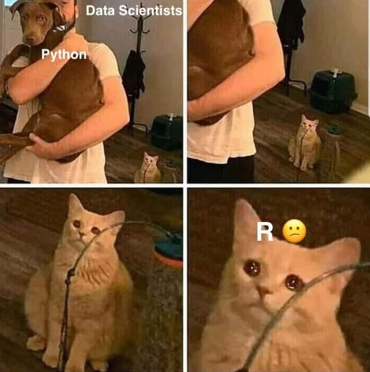

```{r setup, include=FALSE, fig.align="center"}
knitr::opts_chunk$set(echo = TRUE)
```

Hey what's up, I'm Robert. In my free time, I like to hit the gym, play the piano, play chess and other board games and occasionally play some dota with my old classmates. More professionally speaking, I like to write code and wrangle, analyse, model and visualise data. It's pretty cool to have millions of rows of seemingly random numbers or words, but with the help of statistics and machine learning, one can uncover its secrets and also peek into the future.

The reason for starting this blog is simple - to get better. At programming, machine learning and data visualisation. I don't have a lot of formal computer science education, so I have some catching up to do. My bachelor's was in Accounting & Finance, inspired from my endless fascination for the stock market when I was in high school. I still find it fascinating, but turns out I don't have to know how to consolidate financial statements to ~~gamble with~~ invest in Gamestop. I pretty much knew after my first year at Warwick that I am way more passionate about data science. But by getting my master's degree in Actuarial and Financial Engineering from the University of Tartu, combined with some online courses, I think I've made a successful transition. Studying at Tartu is definitely the most I've ever learned in two years. The curriculum wa heavy in calculus, probability theory and statistics and programming. That's also where I first met R, which was love at first sight. I also had the chance to opt for electives that cover even more data science oriented topics, such as machine learning and databases. 


Going forward, I will at first be working with R as that's what I'm most comfortable with currently. Later on, I will also polish my Python skills with a deep learning project. "All models are wrong, but some are useful" as someone once said. So inevitably, with this blog, I will contribute to the former category, but hopefully also to the latter one.

<center>

{width=45% .external}

</center>

